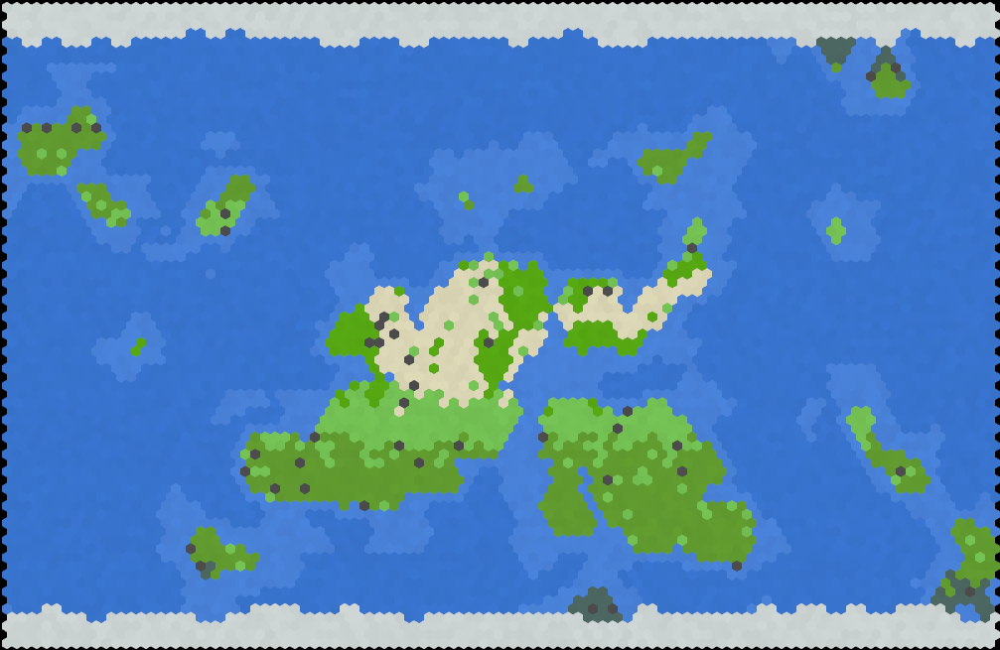

# enigmap
Hexagonal map generator and renderer written in Rust.

    use enigmap::generators::{MapGen, Islands};
    use enigmap::renderers::{Renderer, OGL};

    let mut hexmap = HexMap::new(100,75); // data structure for map

    let gen = Islands::default();
    gen.generate(&mut hexmap);

    let renderer = OGL::default();
    let img = renderer.render(&hexmap); // renders to image

## Generators:
* Circular
* Islands

## Renderers:
* Basic (software)
* OpenGL

Example map:

